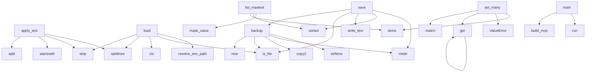

# System Architecture Analysis
<!-- generated in 0.00s -->

## Overview

- **Project**: /home/tom/github/semcod/nlp2env
- **Primary Language**: shell
- **Languages**: shell: 10, python: 6, yml: 5, txt: 2, yaml: 1
- **Analysis Mode**: static
- **Total Functions**: 22
- **Total Classes**: 1
- **Modules**: 28
- **Entry Points**: 14

## Architecture by Module

### src.nlp2env.env_file
- **Functions**: 10
- **Classes**: 1
- **File**: `env_file.py`

### src.nlp2env_mcp.server
- **Functions**: 5
- **File**: `server.py`

### scripts.test-mcp-live
- **Functions**: 3
- **File**: `test-mcp-live.sh`

### src.nlp2env.profiles
- **Functions**: 2
- **File**: `profiles.py`

### examples.integrators.mcp-stdio.e2e
- **Functions**: 1
- **File**: `e2e.sh`

### examples.integrators.todomat-dispatch.e2e
- **Functions**: 1
- **File**: `e2e.sh`

### examples.write.apply-text.e2e
- **Functions**: 1
- **File**: `e2e.sh`

### examples.write.custom-keys.e2e
- **Functions**: 1
- **File**: `e2e.sh`

## Key Entry Points

Main execution flows into the system:

### src.nlp2env.env_file.EnvFile.apply_text
> Parse KEY=value lines or simple 'key: value' pairs from text.
- **Calls**: text.splitlines, raw.strip, line.startswith, line.split, None.strip, line.split, None.replace, re.match

### src.nlp2env.env_file.EnvFile.load
- **Calls**: src.nlp2env.env_file.resolve_env_path, resolved.is_file, cls, None.splitlines, raw.strip, _LINE_RE.match, resolved.read_text, line.startswith

### src.nlp2env.env_file.EnvFile.save
- **Calls**: self.path.parent.mkdir, sorted, self.path.write_text, self.path.is_file, self.backup, re.search, lines.append, None.join

### src.nlp2env.env_file.EnvFile.backup
- **Calls**: None.strftime, dest_root.mkdir, shutil.copy2, self.path.is_file, datetime.now

### src.nlp2env.env_file.EnvFile.set_many
- **Calls**: updates.items, ValueError, self.values.get, re.match

### src.nlp2env.env_file.EnvFile.list_masked
- **Calls**: src.nlp2env.env_file.mask_value, sorted, self.values.items

### src.nlp2env_mcp.server.main
- **Calls**: None.run, src.nlp2env_mcp.server.build_mcp

### src.nlp2env.env_file.EnvFile.get
- **Calls**: self.values.get

### examples.integrators.mcp-stdio.e2e.print

### examples.integrators.todomat-dispatch.e2e.print

### examples.write.apply-text.e2e.print

### examples.write.custom-keys.e2e.print

### src.nlp2env.env_file.EnvFile.delete

### scripts.test-mcp-live.print

## Process Flows

Key execution flows identified:

### Flow 1: apply_text
```
apply_text [src.nlp2env.env_file.EnvFile]
```

### Flow 2: load
```
load [src.nlp2env.env_file.EnvFile]
  └─ →> resolve_env_path
```

### Flow 3: save
```
save [src.nlp2env.env_file.EnvFile]
```

### Flow 4: backup
```
backup [src.nlp2env.env_file.EnvFile]
```

### Flow 5: set_many
```
set_many [src.nlp2env.env_file.EnvFile]
```

### Flow 6: list_masked
```
list_masked [src.nlp2env.env_file.EnvFile]
  └─ →> mask_value
```

### Flow 7: main
```
main [src.nlp2env_mcp.server]
  └─> build_mcp
```

### Flow 8: get
```
get [src.nlp2env.env_file.EnvFile]
```

### Flow 9: print
```
print [examples.integrators.mcp-stdio.e2e]
```

### Flow 10: delete
```
delete [src.nlp2env.env_file.EnvFile]
```

## Key Classes

### src.nlp2env.env_file.EnvFile
- **Methods**: 8
- **Key Methods**: src.nlp2env.env_file.EnvFile.load, src.nlp2env.env_file.EnvFile.get, src.nlp2env.env_file.EnvFile.set_many, src.nlp2env.env_file.EnvFile.delete, src.nlp2env.env_file.EnvFile.list_masked, src.nlp2env.env_file.EnvFile.backup, src.nlp2env.env_file.EnvFile.save, src.nlp2env.env_file.EnvFile.apply_text

## Data Transformation Functions

Key functions that process and transform data:

## Public API Surface

Functions exposed as public API (no underscore prefix):

- `src.nlp2env_mcp.server.build_mcp` - 95 calls
- `src.nlp2env.env_file.EnvFile.apply_text` - 16 calls
- `src.nlp2env.env_file.EnvFile.load` - 15 calls
- `src.nlp2env.env_file.resolve_env_path` - 14 calls
- `src.nlp2env.env_file.EnvFile.save` - 12 calls
- `src.nlp2env.profiles.email_profile_from_dict` - 8 calls
- `src.nlp2env.env_file.EnvFile.backup` - 5 calls
- `src.nlp2env.env_file.EnvFile.set_many` - 4 calls
- `src.nlp2env.env_file.EnvFile.list_masked` - 3 calls
- `src.nlp2env.profiles.email_profile_status` - 3 calls
- `src.nlp2env_mcp.server.main` - 2 calls
- `src.nlp2env.env_file.mask_value` - 2 calls
- `src.nlp2env.env_file.EnvFile.get` - 1 calls
- `examples.integrators.mcp-stdio.e2e.print` - 0 calls
- `examples.integrators.todomat-dispatch.e2e.print` - 0 calls
- `examples.write.apply-text.e2e.print` - 0 calls
- `examples.write.custom-keys.e2e.print` - 0 calls
- `src.nlp2env.env_file.EnvFile.delete` - 0 calls
- `scripts.test-mcp-live.print` - 0 calls

## System Interactions

How components interact:



## Reverse Engineering Guidelines

1. **Entry Points**: Start analysis from the entry points listed above
2. **Core Logic**: Focus on classes with many methods
3. **Data Flow**: Follow data transformation functions
4. **Process Flows**: Use the flow diagrams for execution paths
5. **API Surface**: Public API functions reveal the interface

## Context for LLM

Maintain the identified architectural patterns and public API surface when suggesting changes.